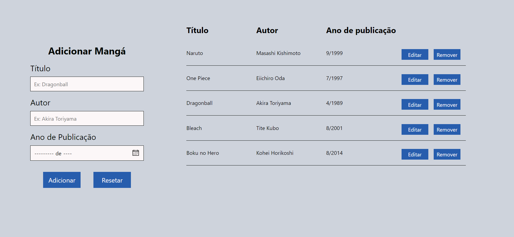

<h1 align="center">Node CRUD</h1>

<p  align="center">
  <a  href="https://www.linkedin.com/in/luan-souza-6b07b1171/">
    
  </a>

  

  <a  href="https://github.com/LuanSilveiraSouza/node-simple-crud/commits/master">
    
  </a>

  

  <a  href="https://github.com/LuanSilveiraSouza/node-simple-crud/stargazers">
    
  </a>
</p>

# :pushpin: Sumary

* [Introduction](#paperclip-introduction)
* [Features](#clipboard-features)
* [Screenshots](#camera-screenshots)
* [Technologies](#computer-technologies)
* [How to Run](#rocket-how-to-run)
* [Bugs and Issues](#bug-bugs-and-issues)
* [Contributing](#man_mechanic-contributing)
* [License](#books-license)

# :paperclip: Introduction

This project is a simple CRUD application to register, update, delete and list japanese mangas. 
Made for study and practicing purposes

# :clipboard: Features

* Register Mangas
* List Mangas
* Update Mangas
* Delete Mangas

# :camera: Screenshots

## Web Screenshots
<p align="center">
  
</p>

# :computer: Technologies

* [Node.js](https://nodejs.org/en/)
* [Express](https://expressjs.com/)
* [EJS](https://ejs.co/)
* [Postgres Drive for Node](https://www.npmjs.com/package/pg)
* [Postgres Database](https://www.postgresql.org/)
* [Docker](https://www.docker.com/)


# :rocket: How to Run

```bash
# Clone Repository
$ git clone https://github.com/LuanSilveiraSouza/node-simple-crud.git
```
### Run Database

```bash
# Create Docker Database Container
$ docker run --name postgres -e POSTGRES_PASSWORD=dockerpostgres -p 5432:5432 -d postgres
```
Access Database in http://localhost:5432/ with [PgAdmin4](https://www.pgadmin.org/) or other Postgres Client

### Run Application

```bash
# Go to folder
$ cd node-simple-crud

# Install Packages
$ npm install

# See .example.env and create a .env file with your database credentials and app port
$ touch .env

# Run Application
$ npm start
```
Access http://localhost:3000/manga to see the main page of the website.

# :bug: Bugs and Issues

Feel free to open new issues and colaborate with others issues in [Node-Simple-Crud Issues](https://github.com/LuanSilveiraSouza/node-simple-crud/issues).

# :man_mechanic: Contributing

There are many forms to contribute with the project, first of all you can give this github repo a Star.

If you want do help with the code follow the steps bellow

```bash
# Fork this Repository https://github.com/LuanSilveiraSouza/node-simple-crud

# Clone your fork
$ git clone {your-fork-url}
$ cd node-simple-crud

# Create a branch with your feature
$ git checkout -b {branch-name}

# Make the commit with your changes
$ git commit -m 'Feat: {feature-name}'

# Send the code to your remote branch
$ git push origin {branch-name}
```
Then send a Pull Request that will be analyzed and approved if it helps with the project

# :books: License

Released in 2020 under [MIT License](https://opensource.org/licenses/MIT)

Made with :heart: by Luan Souza.